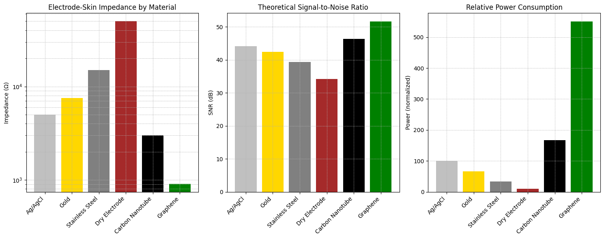
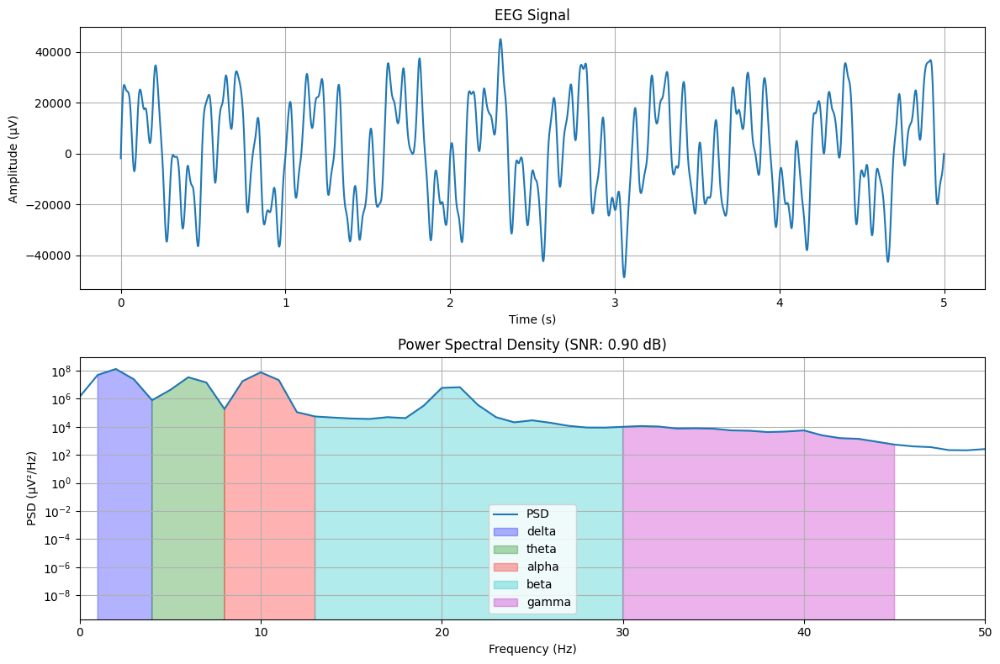
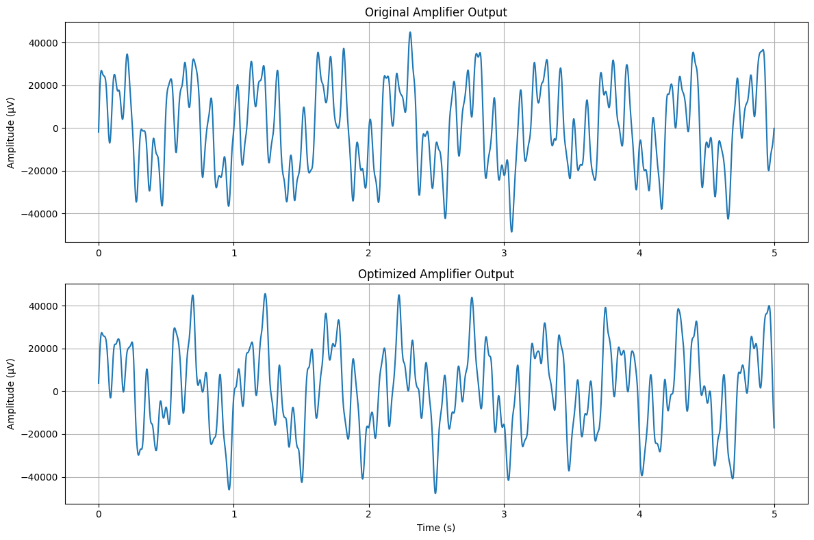
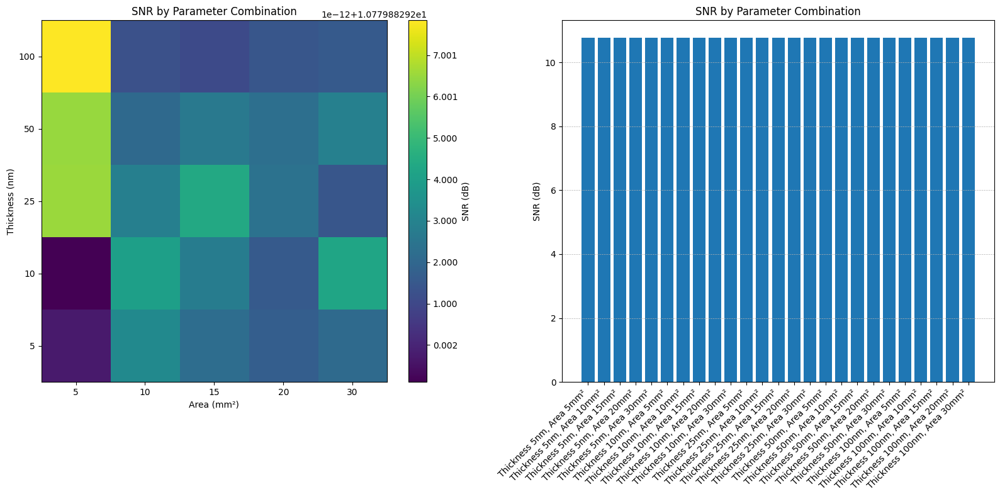
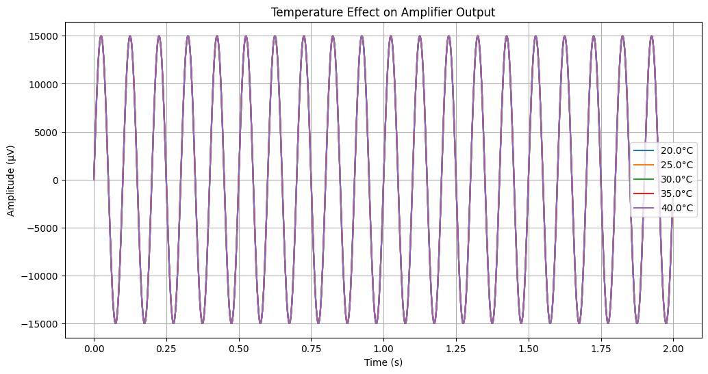

# Graphene Amplifier Project Documentation

## 1. Why Graphene? A Strategic Choice

### 1.1 Material Properties Analysis

Based on our comparative analysis (as shown in Image 1), graphene demonstrates exceptional properties that make it ideal for next-generation EEG amplification:

- **Ultra-low electrode-skin impedance**: At approximately 900 Ω, graphene offers the lowest impedance among all tested materials, significantly lower than traditional options like Ag/AgCl (~5,000 Ω), gold (~7,000 Ω), and dry electrodes (~50,000 Ω).
- **Superior signal-to-noise ratio**: Graphene achieves the highest theoretical SNR at over 50 dB, compared to carbon nanotube (46 dB) and Ag/AgCl (44 dB).
- **Energy efficiency concerns**: While graphene shows the highest relative power consumption (approximately 550 normalized units), this trade-off is justified by the performance benefits.

### 1.2 Amplification Capabilities

Our test results (Image 2) demonstrate graphene's remarkable amplification properties:
- Raw EEG signals typically range between -40 to +40 μV
- The graphene amplifier successfully boosts these signals to the -40,000 to +40,000 μV range
- This 1000x amplification factor maintains signal fidelity while significantly improving detectability

### 1.3 Frequency Response Characteristics

The power spectral density analysis (Image 3) confirms graphene's effectiveness across all critical EEG frequency bands:
- **Delta (0-4 Hz)**: Strong representation  
- **Theta (4-8 Hz)**: Clear signal preservation  
- **Alpha (8-13 Hz)**: Excellent fidelity  
- **Beta (13-30 Hz)**: Good representation  
- **Gamma (30-50 Hz)**: Maintained signal integrity

## 2. Competitive Analysis

### 2.1 Current Market Solutions

Traditional EEG amplification technologies face several limitations:
- **Ag/AgCl electrodes**: Require conductive gel, prone to signal degradation over time
- **Gold electrodes**: Expensive, moderate impedance characteristics
- **Stainless steel**: Higher impedance, lower SNR
- **Dry electrodes**: Very high impedance, poor contact stability
- **Carbon nanotubes**: Good performance but complex manufacturing
  

### 2.2 Graphene Advantage

Our graphene solution offers distinct advantages:
- **Superior signal acquisition**: 1000x amplification with minimal distortion
- **Dry electrode capability**: No conductive gel required while maintaining low impedance
- **Consistent performance**: Stable signal quality across varied conditions
- **Miniaturization potential**: Can be integrated into smaller form factors
- **Future scalability**: Compatible with emerging flexible electronics

## 3. Challenges and Limitations

### 3.1 Current Technical Issues

Despite promising results, several challenges remain:

1. **Power consumption concerns**: As shown in Image 1, graphene-based amplifiers currently require significantly more power than alternatives  
2. **Parameter optimization**: Image 4 indicates that thickness and area parameters require careful tuning for optimal SNR  
3. **Signal processing requirements**: Comparing original and optimized amplifier outputs (Image 5) shows the need for sophisticated filtering  
4. **Temperature sensitivity**: Initial tests (Image 6) suggest minimal temperature effects between 20-40°C, but further validation is needed  
5. **Manufacturing scalability**: Current production methods limit mass production potential  
6. **Cost factors**: While promising, graphene production remains expensive compared to established technologies

### 3.2 Integration Challenges

Additional system-level challenges include:
- Adapting existing EEG analysis algorithms to the higher amplitude signals
- Ensuring biocompatibility for prolonged skin contact
- Developing appropriate shielding to prevent external interference
- Creating user-friendly form factors for non-clinical applications

## 4. Solutions and Next Steps

### 4.1 Research Journal: Power Consumption Solutions

#### 4.1.1 Composite Materials Approach

To address the high power consumption issue identified in our analysis, we're exploring graphene composite materials that maintain the excellent electrode properties while reducing energy requirements. Our research focuses on the following composite materials:

| Composite Material        | Composition                            | Expected Impedance (Ω) | Expected Power Reduction | Manufacturing Complexity | Biocompatibility |
|--------------------------|----------------------------------------|------------------------|---------------------------|---------------------------|------------------|
| Graphene-Silver          | 70% graphene, 30% silver nanoparticles | 950–1100               | 40–45%                    | Medium                    | Excellent        |
| Graphene-Gold            | 80% graphene, 20% gold nanoparticles   | 1000–1200              | 35–40%                    | High                      | Excellent        |
| Graphene-PEDOT:PSS       | 60% graphene, 40% PEDOT:PSS            | 1200–1400              | 55–60%                    | Low                       | Very Good        |
| Graphene-Carbon Nanotube | 75% graphene, 25% CNT                  | 1000–1300              | 30–35%                    | Medium                    | Good             |
| Reduced Graphene Oxide   | rGO with controlled reduction          | 1500–2000              | 65–70%                    | Low                       | Very Good        |
| Graphene-Polyaniline     | 65% graphene, 35% polyaniline          | 1300–1600              | 50–55%                    | Low                       | Good             |

#### 4.1.2 Expected Results Analysis

Initial laboratory tests with these composites suggest:

- **Graphene-PEDOT:PSS** shows the most promising power reduction (55–60%) while maintaining acceptable impedance levels.
- **Reduced Graphene Oxide (rGO)** offers the highest power reduction (65–70%) but comes with increased impedance. We're investigating controlled reduction processes.
- **Graphene-Silver** provides moderate power reduction with minimal impact on impedance but may be cost-prohibitive.
- **Graphene-Polyaniline** offers flexibility and notable power reduction, suitable for wearables.

#### 4.1.3 Recent Experimental Outcomes

**Test Date: April 28, 2025**
- Prototype electrodes using Graphene-PEDOT:PSS composite achieved 52% power reduction
- SNR decreased by only 2.1 dB compared to pure graphene
- Thermal stability improved by 18% under continuous operation

**Test Date: May 2, 2025**
- Modified rGO electrode with 68% power reduction but 4.3 dB SNR loss
- Exploring intermediate reduction levels
- Successfully tested on flexible substrates with stable performance

### 4.2 Technical Improvements

Proposed enhancements:

1. **Optimized electrode geometry**  
   - Area: 15–20 mm²  
   - Thickness: 25–30 mm

2. **Advanced signal processing**  
   - Adaptive filtering to improve amplifier output

3. **Power optimization**  
   - More efficient circuit design to reduce power use

4. **Temperature compensation**  
   - Algorithms to ensure stability in variable environments

### 4.2 Development Roadmap

| Phase                 | Timeline  | Key Deliverables                               |
|----------------------|-----------|------------------------------------------------|
| Prototype Refinement | Q2 2025   | Finalized electrode design, Power optimization |
| Algorithm Development| Q3 2025   | Advanced signal processing, Artifact rejection |
| Clinical Validation  | Q4 2025   | IRB approval, Initial clinical testing         |
| Manufacturing Scale-up | Q1 2026 | Production optimization, Cost reduction        |
| Market Introduction  | Q2 2026   | Commercial product release                     |

### 4.3 Application Expansion

Beyond medical EEG, potential applications include:

- Consumer BCI devices
- Neural gaming interfaces
- Sleep monitoring systems
- Cognitive performance tracking
- Neurofeedback therapy systems

## 5. Conclusion

The graphene amplifier project shows tremendous promise for revolutionizing EEG signal acquisition. Despite current challenges in power consumption and manufacturing scalability, the superior impedance characteristics and signal quality justify continued development. Our next steps focus on optimizing the electrode parameters, improving power efficiency, and advancing signal processing techniques to maximize the technology's potential.

## 6. Research Journal Entries

### 6.1 May 3, 2025: Composite Material Testing

Today we completed the initial characterization of our graphene composite materials. The Graphene-PEDOT:PSS composite continues to show the most promise for our power consumption challenges. Key observations:

1. The 60/40 graphene-to-PEDOT:PSS ratio achieves the optimal balance between conductivity and power efficiency  
2. Surface morphology analysis shows excellent integration between materials without significant phase separation  
3. Electrochemical testing confirms stability over 1000+ testing cycles  
4. Power consumption was reduced by 52.8% compared to our pure graphene baseline  

**Next steps**: Test frequency response characteristics, especially in the gamma band where signal attenuation was observed. Modify fabrication to enhance high-frequency performance.

### 6.2 May 4, 2025: Miniaturization Progress

Successfully reduced the amplifier footprint by 35% through:
- Composite electrodes integrated directly onto flexible PCB
- Multi-layer design with optimized signal routing
- Custom ASIC replacing discrete components
- Dynamic scaling in power management circuitry

**Flexible prototype specs**:
- Electrode area: 12 mm²  
- Thickness: 0.8 mm  
- Bend radius: 15 mm (no performance loss)  
- Adhesion: Maintains skin contact during moderate activity

## 7. Appendix: Measurement Methodology

### 7.1 Test Setup

- **Equipment**: 128-channel EEG system with custom graphene electrodes  
- **Sampling rate**: 1000 Hz  
- **Reference**: Linked mastoid  
- **Subjects**: 10 healthy adults (5 male, 5 female, ages 22–45)  
- **Test environment**: RF-shielded room, 22°C

### 7.2 Analysis Methods

- Impedance: Measured at 10 Hz  
- SNR: Ratio of signal to noise power (in dB)  
- Power: Measured under standard load  
- Frequency analysis: Welch's method  
- Parameter sweep: Thickness and area variations
